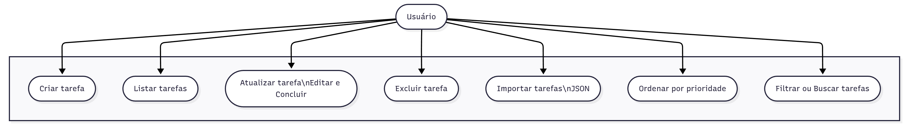
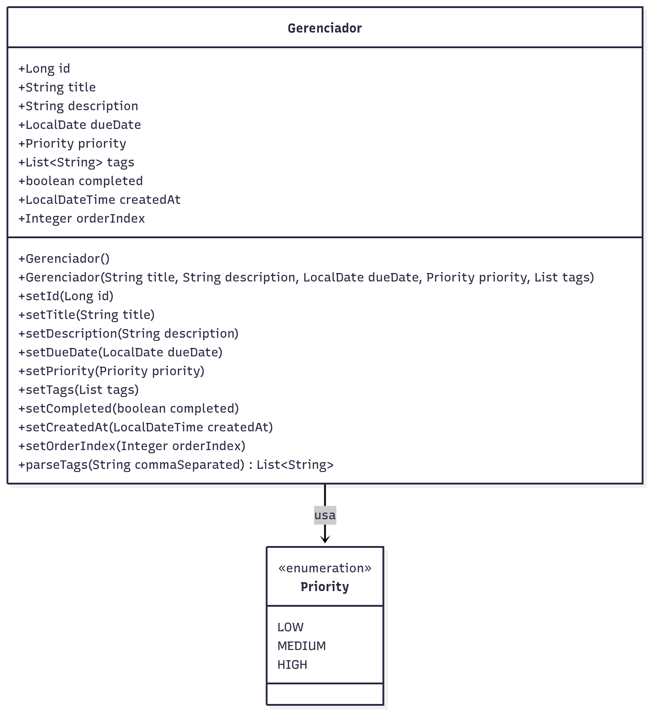

# TRABALHO DA DISCIPLINA DA FACULDADE DE PROGRAMA ORIENTADO A OBJETO

✨ Funcionalidades

- Criar tarefa

- Editar tarefa

- Marcar como concluída

- Excluir tarefa

- Importar tarefas via JSON

- Ordenar por prioridade ou data
<br>

</br>


  

📦 Diagrama De Caso de Uso



📦 Diagrama de Classes


📦 Requisitos

JDK 17+
Maven 3.6+
IntelliJ IDEA ou outro IDE (opcional)

Observação:
Para este projeto está sendo utilizado o banco H2, devido à sua facilidade de teste e configuração automática.


▶ Como executar o projeto
1. Clonar o repositório
```bash
   git clone https://github.com/seu-usuario/gerenciadorDeTarefas.git
```
2. Construir o projeto
```bash
   mvn clean install
```
3. Executar a aplicação via terminal
```bash
  mvn spring-boot:run
```
4. Acessar a aplicação
```bash
http://localhost:8080
```
5. Console H2 (opcional)
```bash
http://localhost:8080/h2-console
```
